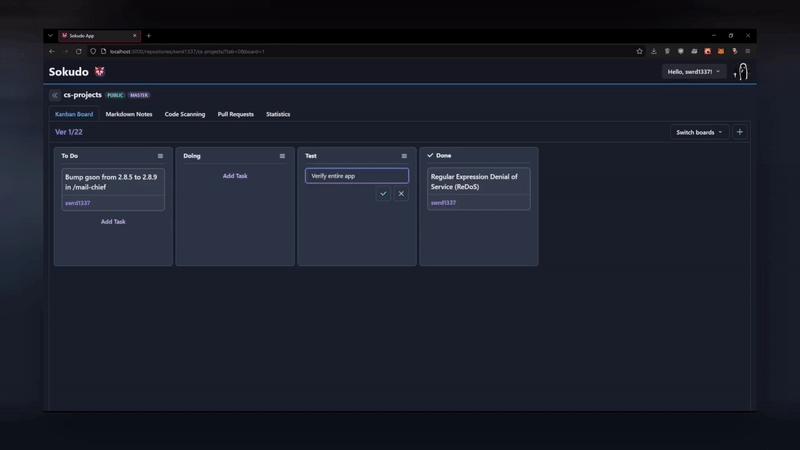

# 👹 Sokudo

*Sokudo* (*speed* from japanese) is an application that implements the principles of Agile software development, particularly project management, and is based on **GitHub API** using features offered by **GitHub Apps**.

### Short demonstration:

<details open>
<summary><u>Example #1</u></summary>

</details>

<details>
<summary><u>Example #2</u></summary>

</details>

<details>
<summary><u>Example #3</u></summary>

</details>

## Built With

* [React](https://reactjs.org/)
* [TypeScript](https://www.typescriptlang.org/)
* [Chakra UI](https://chakra-ui.com/)
* [Java](https://www.java.com/)
* [Spring Boot](https://spring.io/projects/spring-boot)
* [MongoDB](https://www.mongodb.com/)
* [GitHub Apps](https://docs.github.com/en/developers/apps/getting-started-with-apps/about-apps)

For more details check `client/package.json` and `server/build.gradle`.

## Prerequisites

* Java 16+
* MongoDB instance (you can use docker container)
* NodeJS 16.6+
* NPM 7.20+

## Installation

This section will show you how to install the frontend and backend parts to work together.

### Backend:
1. Go to the `server` folder.
1. Run `./gradlew clean build` to download all required dependencies.
1. Open the properties file located at `src/main/resources/application.properties`.
1. Define the following variables:
```bash
server.port=8900 # Default port.

spring.data.mongodb.host=host.docker.internal # Default host.
spring.data.mongodb.port=27017 # Default port.

git.provider.client.id=<github-apps-client-id> # Generated from GitHub Apps.
git.provider.client.secret=<github-apps-client-secret> # Generated from GitHub Apps.
git.provider.access.token.issuer.url=https://github.com/login/oauth/access_token # Default URL.

git.provider.base.url=https://api.github.com # Default URL.
```
4. Run the application from your IDE or with the following command: `./gradlew bootRun`.

### Frontend:

1. Go to the `client` folder.
1. Run `npm install`.
1. Create `.env` file.
1. Open the created file with your favorite editor.
1. Define the following variables:
```bash
VITE_GH_AUTHORIZE_URL=https://github.com/login/oauth/authorize
VITE_GH_CLIENT_ID=<github-apps-client-id> # Generated from GitHub Apps.
VITE_API_BASE_URL=http://<server-host>:<server-port>/api
VITE_OAUTH_PROXY_URL=http://<server-host>:<server-port>/proxy/oauth
```
6. Save the file.
1. Run application with `npx vite --port=<port>`.

## Contributing
Pull requests are welcome. For major changes, please open an issue first to discuss what you would like to change.

Please make sure to update tests as appropriate.

## To Do 🛠️
* Add caching for external API calls.
* Pre-authorize API methods using a list of current user repositories.
* GH Token expired handler.
* Add code docs for API.
* Dark/white theme switch.

## License
[GPL3](LICENSE)

